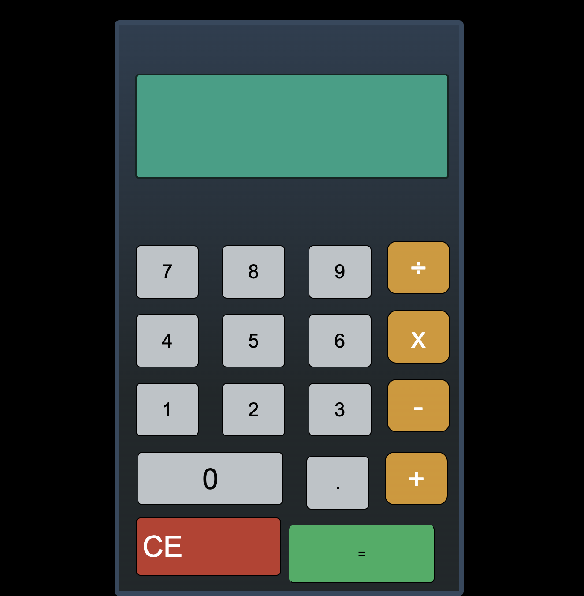

# Simple Calculator

Do some math here! [here](https://kurtis-casperson.github.io/calculator-app/)

## Description

This calculator app really helped me to develop my debugging skills, and was a great exercsie for expanding my "tool box" for how I approach the design of an app.
This was my first time using flexbox, so I had to spend some time designing my html and css before I could just dive into the javascript.

I created arrays the operand variables as arrays because I thought that would be the best way to add multiple operations together... ehhh not so much!
After refactoring, I removed the ~~arrays~~ to instead use empty strings for each variable. _This makes the code much more concise with less complicated conditional operations._

Calculator Functionality :

- Basic Mathematic equations
- Continuous functions: 1 + 1 + 1 + 1 = 4 OR 1 + 2 = 3 / 1 = 3
- Displays decimals to the thousandth (.001)

## Author

Kurtis Casperson
connect with me [LinkedIn](https://www.linkedin.com/feed/) !
