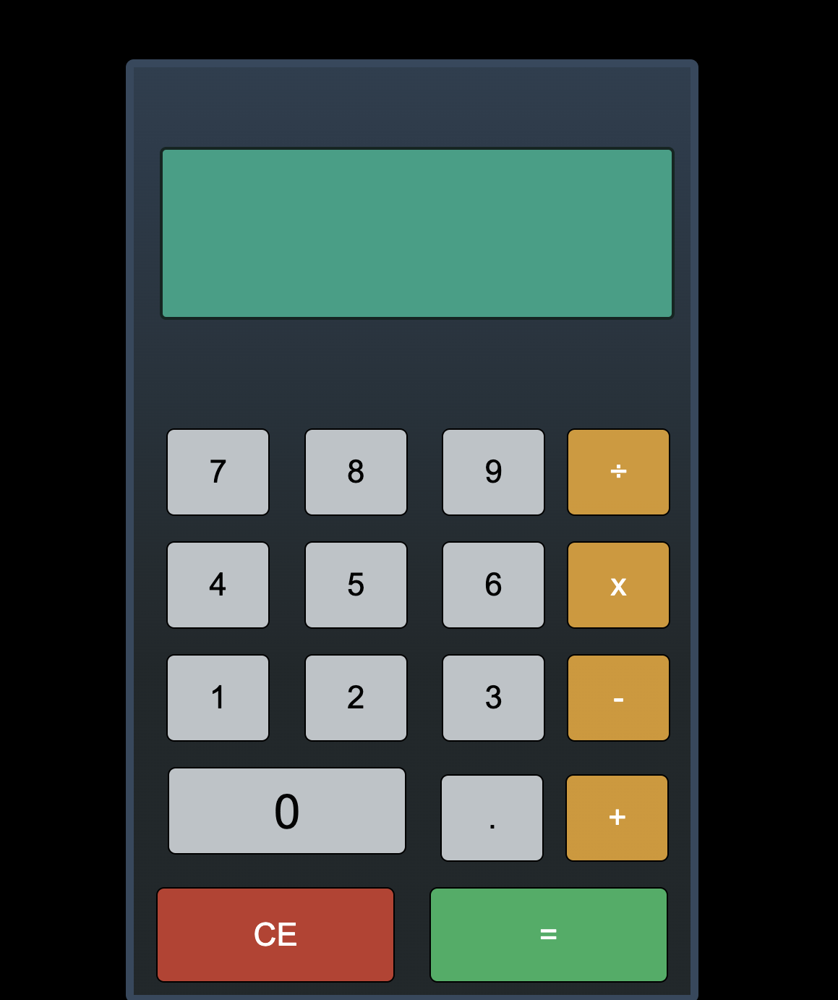

# Simple Calculator

Do some math here! [here](https://kurtis-casperson.github.io/calculator-app/)

## Description

This calculator app really helped me to develop my debugging skills, and was a great exercsie for expanding my "tool box" for how I approach the design of an app.
This was my first time using flexbox, so I had to spend some time designing my html and css before I could just dive into the javascript.

I created arrays the operand variables as arrays because I thought that would be the best way to add multiple operations together... ehhh not so much!

By the time I realized that creating empty variables would have been simpler, I thought that I had gone too far. So I came up with some creative ways to meet all of the conditionals required!

## Author

Kurtis Casperson
connect with me [LinkedIn](https://www.linkedin.com/feed/) !
